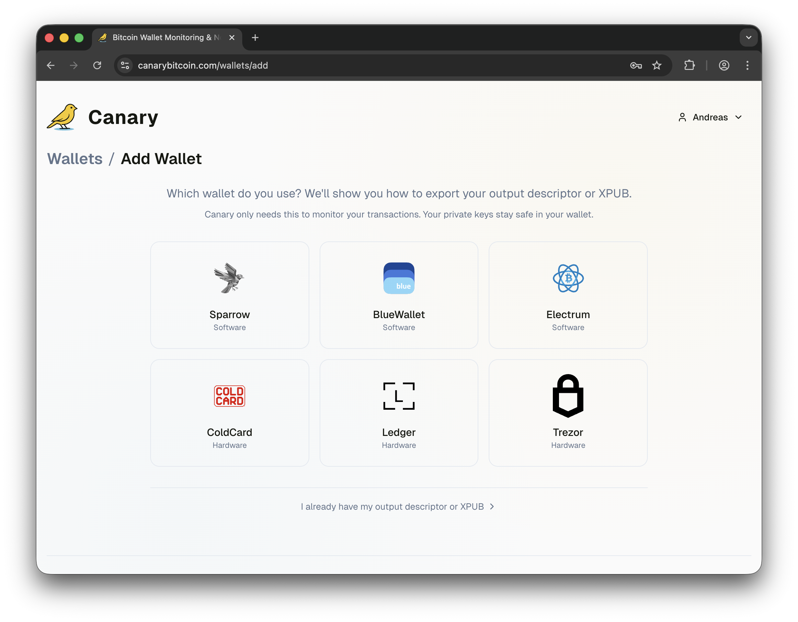
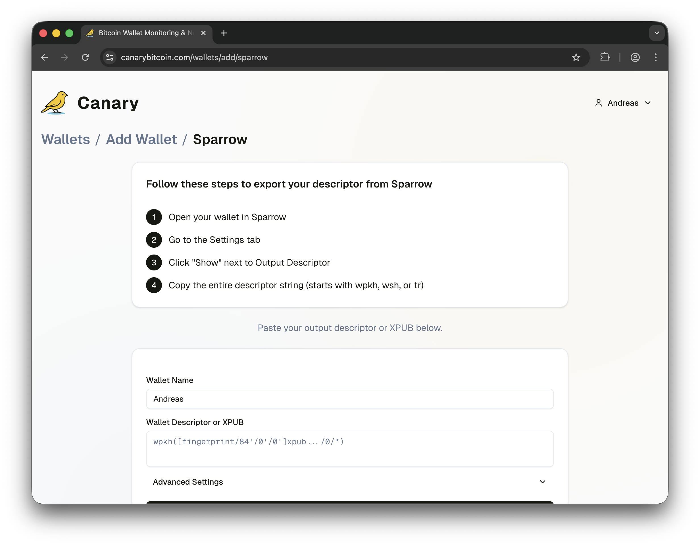
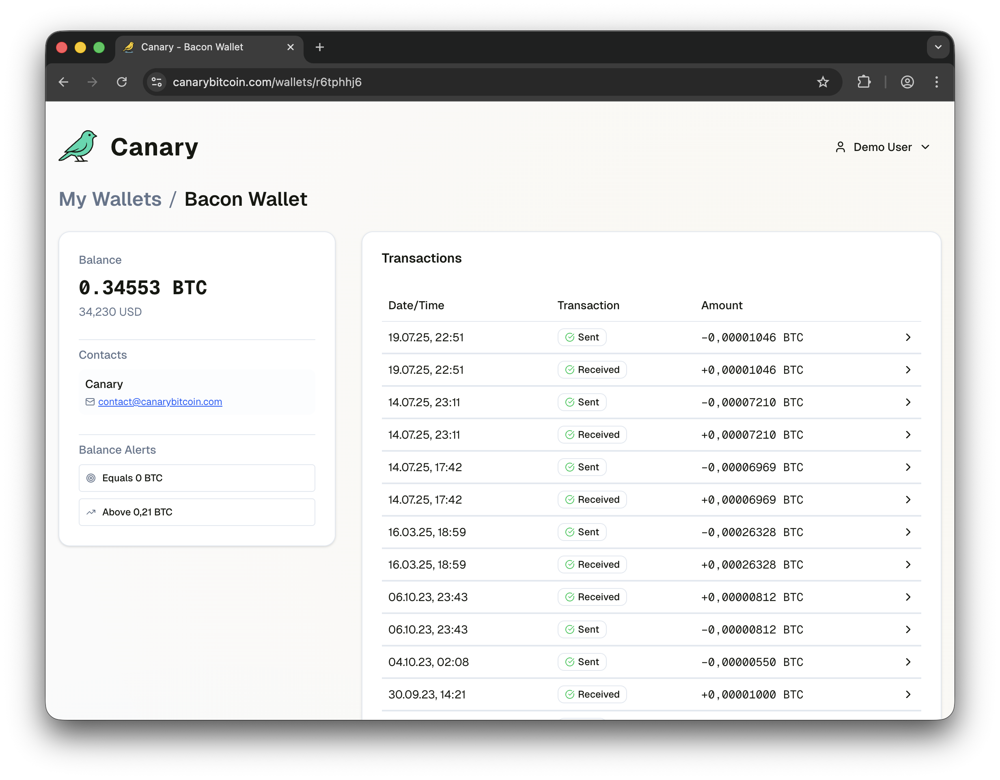
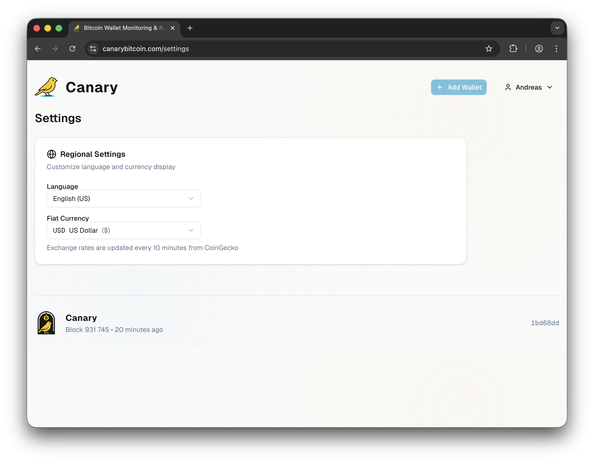

# Canary


Canary is a **Bitcoin monitoring and early warning system** built in [Rust](https://www.rust-lang.org/) using [BDK (Bitcoin Development Kit)](https://bitcoindevkit.org/) with a [Next.js](https://nextjs.org/) frontend. It provides real-time transaction intelligence, advanced pattern recognition (RBF, CPFP, consolidation), and instant multilingual notifications for Bitcoin wallet activity - designed specifically for monitoring cold storage and Bitcoin holdings you don't actively use.

## Why Use Canary?

**A canary in the cold mine** - When your bitcoins are in cold storage, you seldom check on them. Canary acts as an early warning system that alerts you the moment your coins move, giving you immediate notification of any activity on your wallets.

## Screenshots

### Add a Wallet
Select your wallet type from popular software wallets (Sparrow, BlueWallet, Electrum) or hardware wallets (ColdCard, Ledger, Trezor). Canary only needs read-only access to monitor transactions - your private keys stay safe in your wallet.



### Step-by-Step Setup
Follow wallet-specific instructions to export your output descriptor or XPUB. Each supported wallet has tailored guidance to make setup easy.



### Wallet Dashboard
View your balance in BTC and fiat, manage notification contacts, configure balance alerts, and see your complete transaction history with send/receive indicators.



### Settings
Customize your language preference (9 languages supported) and fiat currency display. Exchange rates update automatically via CoinGecko.



## Key Features

### Transaction Monitoring
- Sending and receiving bitcoin notifications
- Transaction confirmation alerts
- **RBF (Replace-By-Fee)** detection - fee bumping notifications
- **CPFP (Child-Pays-For-Parent)** detection - transaction acceleration notifications

### Balance Alerts
- Configurable threshold alerts (above/below/equals)
- Support for both BTC and fiat currency thresholds
- Smart crossing detection to prevent notification spam
- Auto-disable after firing with manual reactivation

### Notifications
Real-time notifications in 9 languages via **[ntfy.sh](https://ntfy.sh)** push notifications (self-hostable).

[canarybitcoin.com](https://canarybitcoin.com) additionally supports **SMS** (via Twilio) and **Email** (via Resend) notifications.

**Supported Languages:** English, Norwegian, Spanish, Portuguese, German, French, Japanese, Danish, Swedish

> **Umbrel / Docker note:** On Umbrel, Canary auto-detects the local ntfy app through the Docker-internal URL provided by the Umbrel package. You should not need to enter `http://ntfy_app_1` manually. Use "Send Test Notification" in Settings to verify your configuration.

## Self-Hosted vs. canarybitcoin.com

| | Self-Hosted | [canarybitcoin.com](https://canarybitcoin.com) |
|---|---|---|
| **Users** | Single user, no auth required | Multi-user with email/password authentication |
| **Notifications** | ntfy.sh push notifications | ntfy.sh + SMS + Email |
| **Billing** | Free | Subscription plans (Personal & Team) |
| **Wallet sync** | Fixed interval | Tier-based (faster sync on higher plans) |

## Quick Start

### Prerequisites
- Rust toolchain
- Node.js 18+
- Docker and Docker Compose (for local Bitcoin regtest)

### Configuration
```bash
# Backend - choose your mode
cd backend
cp .env.example.self-hosted .env  # or .env.example.cloud

# Frontend
cd frontend
cp .env.example.self-hosted .env.local  # or .env.example.cloud
```

### Development
```bash
# Start local Bitcoin regtest environment
cd scripts && docker-compose up -d

# Start backend (requires Stripe CLI for cloud mode)
cd backend && cargo run

# Start frontend
cd frontend && pnpm dev
```

## Development & Testing

### Displaying Git Version in Footer

The frontend displays the git version and commit hash in the footer. To generate this build info locally:

```bash
# Generate build info (creates src/lib/build-info.json)
cd frontend && node scripts/generate-build-info.js

# Then start the dev server
pnpm dev
```

The footer will display in format: `v0.13.0 • 5e66fe3` (tag and commit) or just the commit hash if no tag exists.

**Note**: The build info is automatically generated during production builds via the webpack configuration. For local development, you need to run the script manually.

### Running System Tests

The project includes comprehensive system tests that use Docker to create isolated Bitcoin regtest environments. These tests cover:

- **Advanced Transactions**: RBF (Replace-By-Fee) and CPFP (Child-Pays-For-Parent) scenarios
- **High Index Scanning**: Deep wallet address discovery for funds at high indexes
- **Direct Mining**: Transactions that get mined directly without mempool delays
- **Two-Stage Scenarios**: Complex transaction flows with multiple confirmations
- **Balance Alerts**: Threshold-based balance monitoring

#### Prerequisites
- Docker and Docker Compose installed
- Rust toolchain for building

#### Run All System Tests
```bash
# Run all system tests (sequential to avoid Docker conflicts)
cd backend
cargo test --test advanced_transactions --test mined_directly_scenarios --test two_stage_send_scenarios --test high_index_scanning --test balance_alert_scenarios -- --ignored --test-threads=1
```

#### Run Individual Test Categories
```bash
cd backend

# Advanced transactions (RBF, CPFP) - 3 tests
cargo test --test advanced_transactions -- --ignored

# High index scanning - 1 test
cargo test --test high_index_scanning -- --ignored

# Mined directly scenarios - 3 tests
cargo test --test mined_directly_scenarios -- --ignored

# Two-stage send scenarios - 3 tests
cargo test --test two_stage_send_scenarios -- --ignored

# Balance alert scenarios
cargo test --test balance_alert_scenarios -- --ignored
```

**Note**: System tests must run sequentially (`--test-threads=1`) to avoid Docker resource conflicts between parallel test environments.

## Documentation

See [CLAUDE.md](CLAUDE.md) for comprehensive documentation including:
- API endpoints
- Database schema
- Notification setup
- Stripe integration
- Architecture details

## License

See [LICENSE.md](LICENSE.md) for license information.
